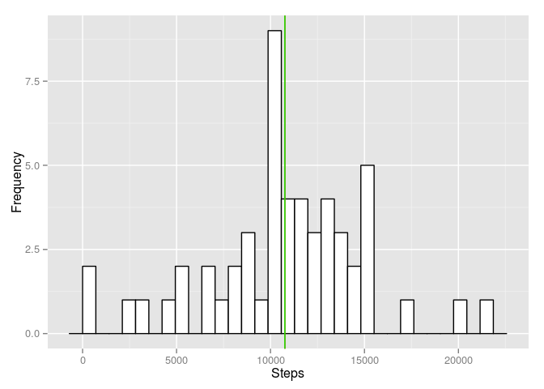
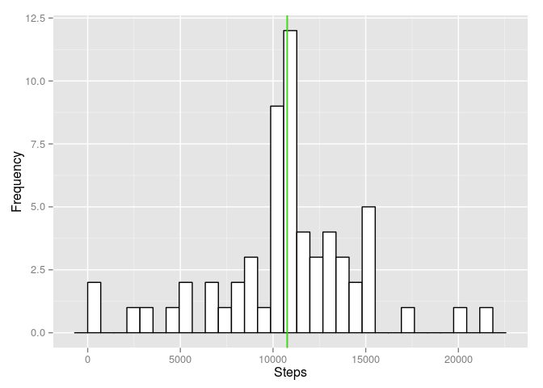
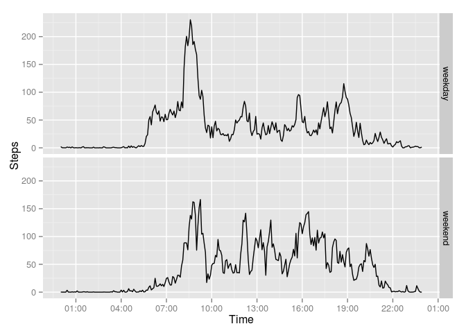

# Reproducible Research: Peer Assessment 1

## Init

```r
library(ggplot2)
library(scales)
time.padding <- function(time){
    new_str <- paste(10000 + time, sep='')
    new_str <- substr(new_str, 2, nchar(new_str))
    new_str
}
```
## Loading and preprocessing the data

```r
actData <- read.csv("Data/activity.csv")
actData <- transform(actData, 
                     date=as.Date(date),
                     datetime=strptime(mapply(paste, date, time.padding(interval), collapse=" "),
                                       format="%Y-%m-%d %H%M"),
                     daytime=format(strptime(time.padding(interval),
                                             format="%H%M"), "%H:%M:%S"))
head(actData)
```

```
##   steps       date interval            datetime  daytime
## 1    NA 2012-10-01        0 2012-10-01 00:00:00 00:00:00
## 2    NA 2012-10-01        5 2012-10-01 00:05:00 00:05:00
## 3    NA 2012-10-01       10 2012-10-01 00:10:00 00:10:00
## 4    NA 2012-10-01       15 2012-10-01 00:15:00 00:15:00
## 5    NA 2012-10-01       20 2012-10-01 00:20:00 00:20:00
## 6    NA 2012-10-01       25 2012-10-01 00:25:00 00:25:00
```


## What is mean total number of steps taken per day?

```r
stepsDay <- tapply(actData$steps[!is.na(actData$steps)],
                   actData$date[!is.na(actData$steps)], sum)
stepsDay <- as.vector(stepsDay)
stepsMean <- mean(stepsDay)
stepsMedian <- median(stepsDay)
qplot(stepsDay, xlab="Steps", ylab="Frequency") + geom_histogram(colour="black", 
                                                                 fill="white") +
    geom_vline(xintercept=stepsMean, color="red") + 
    geom_vline(xintercept=stepsMedian, color="green")
```

```
## stat_bin: binwidth defaulted to range/30. Use 'binwidth = x' to adjust this.
## stat_bin: binwidth defaulted to range/30. Use 'binwidth = x' to adjust this.
```

 

```r
stepsMean
```

```
## [1] 10766.19
```

```r
stepsMedian
```

```
## [1] 10765
```
The average and the median of the steps taken per day are 10766.19 (steps/day) and 10765 (steps/day), respectively.

## What is the average daily activity pattern?

```r
stepsDayP <- tapply(actData$steps[!is.na(actData$steps)],
                    actData$daytime[!is.na(actData$steps)], mean)
dailyAct <- data.frame(time=strptime(names(stepsDayP), "%H:%M:%S"),
                       avg_steps=stepsDayP)

maxAvgInt <- dailyAct[dailyAct$avg_steps==max(dailyAct$avg_steps),]
ggplot(dailyAct, aes(x=time, y=avg_steps)) + geom_line() + xlab("Time") + ylab("Steps") + 
    scale_x_datetime(breaks=date_breaks("3 hours"), labels=date_format("%H:%M")) +
    geom_point(aes(x=maxAvgInt$time, y=maxAvgInt$avg_steps), col="red")
```

```
## Warning in data.frame(x = structure(1426426500, class = c("POSIXct",
## "POSIXt": row names were found from a short variable and have been
## discarded
```

 

```r
maxAvgInt
```

```
##                         time avg_steps
## 08:35:00 2015-03-15 08:35:00  206.1698
```
The 5-minute interval which contains the maximum number of steps occurs at 08:35:00.
This interval is marked with a red dot in the plot above.

## Imputing missing values

There are 2304 missing values in the dataset.

Missing values from an interval are replaced by the mean for that interval as follows:

```r
noNAData <- transform(actData) 
for(i in (1:nrow(noNAData))[is.na(noNAData$steps)]){
    intv <- noNAData$daytime[i]
    noNAData$steps[i] <- dailyAct[rownames(dailyAct)==intv, c("avg_steps")]
}
```

Summary of the original dataset:

```r
summary(actData)
```

```
##      steps             date               interval     
##  Min.   :  0.00   Min.   :2012-10-01   Min.   :   0.0  
##  1st Qu.:  0.00   1st Qu.:2012-10-16   1st Qu.: 588.8  
##  Median :  0.00   Median :2012-10-31   Median :1177.5  
##  Mean   : 37.38   Mean   :2012-10-31   Mean   :1177.5  
##  3rd Qu.: 12.00   3rd Qu.:2012-11-15   3rd Qu.:1766.2  
##  Max.   :806.00   Max.   :2012-11-30   Max.   :2355.0  
##  NA's   :2304                                          
##     datetime                       daytime     
##  Min.   :2012-10-01 00:00:00   00:00:00:   61  
##  1st Qu.:2012-10-16 05:58:45   00:05:00:   61  
##  Median :2012-10-31 11:57:30   00:10:00:   61  
##  Mean   :2012-10-31 11:57:30   00:15:00:   61  
##  3rd Qu.:2012-11-15 17:56:15   00:20:00:   61  
##  Max.   :2012-11-30 23:55:00   00:25:00:   61  
##                                (Other) :17202
```


Summary of the dataset without missing values:

```r
summary(noNAData)
```

```
##      steps             date               interval     
##  Min.   :  0.00   Min.   :2012-10-01   Min.   :   0.0  
##  1st Qu.:  0.00   1st Qu.:2012-10-16   1st Qu.: 588.8  
##  Median :  0.00   Median :2012-10-31   Median :1177.5  
##  Mean   : 37.38   Mean   :2012-10-31   Mean   :1177.5  
##  3rd Qu.: 27.00   3rd Qu.:2012-11-15   3rd Qu.:1766.2  
##  Max.   :806.00   Max.   :2012-11-30   Max.   :2355.0  
##                                                        
##     datetime                       daytime     
##  Min.   :2012-10-01 00:00:00   00:00:00:   61  
##  1st Qu.:2012-10-16 05:58:45   00:05:00:   61  
##  Median :2012-10-31 11:57:30   00:10:00:   61  
##  Mean   :2012-10-31 11:57:30   00:15:00:   61  
##  3rd Qu.:2012-11-15 17:56:15   00:20:00:   61  
##  Max.   :2012-11-30 23:55:00   00:25:00:   61  
##                                (Other) :17202
```


```r
stepsDay <- tapply(noNAData$steps[!is.na(noNAData$steps)],
                   noNAData$date[!is.na(noNAData$steps)], sum)
stepsDay <- as.vector(stepsDay)
stepsMean <- mean(stepsDay)
stepsMedian <- median(stepsDay)
qplot(stepsDay) + geom_histogram(colour="black", 
                                 fill="white") +
    geom_vline(xintercept=stepsMean, color="red") + 
    geom_vline(xintercept=stepsMedian, color="green") + xlab("Steps") + ylab("Frequency")
```

```
## stat_bin: binwidth defaulted to range/30. Use 'binwidth = x' to adjust this.
## stat_bin: binwidth defaulted to range/30. Use 'binwidth = x' to adjust this.
```

 

```r
stepsMean
```

```
## [1] 10766.19
```

```r
stepsMedian
```

```
## [1] 10766.19
```

The mean total number of steps per day remained the same while the median total number of steps per day 
changed with respect to the estimates calculated from the original dataset. In the histogram, only the bin 
containing the mean changed, the rest of the bins remained the same.

## Are there differences in activity patterns between weekdays and weekends?

```r
noNAData <- transform(noNAData, daytype=factor(ifelse(weekdays(noNAData$date, abbreviate=T) %in% c("Sun", "Sat"),
                                                      "weekend", "weekday")))

weekdaysAct <- tapply(noNAData$steps[!is.na(noNAData$steps) & noNAData$daytype == "weekday"],
                      noNAData$daytime[!is.na(noNAData$steps) & "weekday" == noNAData$daytype], mean)
weekdaysAct <- data.frame(time=strptime(names(weekdaysAct), "%H:%M:%S"),
                          avg_steps=weekdaysAct, 
                          daytype=rep("weekday", nrow(weekdaysAct)))
weekendsAct <- tapply(noNAData$steps[!is.na(noNAData$steps) & "weekend" == noNAData$daytype],
                      noNAData$daytime[!is.na(noNAData$steps) & "weekend" == noNAData$daytype], mean)
weekendsAct <- data.frame(time=strptime(names(weekendsAct), "%H:%M:%S"),
                          avg_steps=weekendsAct, 
                          daytype=rep("weekend", nrow(weekendsAct)))
combinedDailyAct <- rbind(weekdaysAct, weekendsAct)
ggplot(combinedDailyAct, aes(x=time, y=avg_steps)) + geom_line() +facet_grid(daytype ~ .) + xlab("Time") + ylab("Steps") + 
    scale_x_datetime(breaks=date_breaks("3 hours"), labels=date_format("%H:%M")) 
```

 
